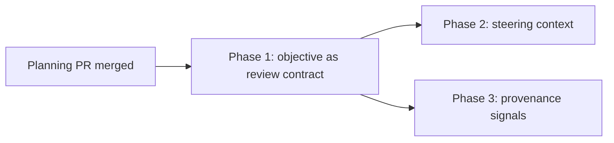

# The goal a workflow run is judged against: phased implementation plan

Source plan: [plan.md](plan.md). Investigation: the Mission Control scout archive for task
`5831fbba`, "Fix goal overwriting in workflow rounds" (archived, not committed).

## Incorporated decisions

These are requirements here, not open questions.

1. Implement proposals A, C and E from the report. Proposal B is already implemented on task
   `fb317738`'s branch (commit `a8610a7b`) and is out of scope. Proposal D, the operator-owned
   goal correction, is deferred.
2. The intent fingerprint keeps its current derivation over `{rawGoal, refinedGoal, decisions}`.
   Everything added to the run snapshot is additive and excluded from it.
3. Runs frozen before this work keep the ask they were frozen with. Nothing rewrites a durable
   snapshot and nothing recompacts existing criteria.
4. The session Goal stays live and keeps being displayed. Only what a REVIEW reads changes.

## Investigated findings

Verified against the repository at `8cc4bb6e`.

- `readLiveWorkflowIntent` (`src/server/workflows/context.ts:993`) builds
  `primaryGoal.rawPrompt` from `goal?.prompt ?? goal?.text ?? ""`. `SessionGoal.objective` is
  never read by any workflow path.
- `captureAcceptedPrompt` (`src/server/registry.ts:7589`) writes `objective` only when there is
  no objective yet. The refiner (`src/server/goal/refiner.ts:399`) then allows only `amend`,
  `replace` and `initial` to move it, and an amendment must retain the prior objective as a
  literal prefix (`refiner.ts:211`). The decision this plan needs already exists and is already
  defended.
- **The verbatim opening ask is not retained.** `objective` starts as the first prompt but is
  overwritten by a later `replace`, and `pendingPrompts` is truncated with
  `current.pendingPrompts.slice(1)` (`refiner.ts:424`) as each revision resolves. Phase 1 must
  persist the opening ask itself; it cannot be recovered from the goal row.
- **There is no durable record of resolved steering.** Same truncation: once a `steer` revision
  is classified it is dropped, and only `relationship`, `focus` and `rationale` for the newest
  one survive. Phase 2 must persist classified steering as it is decided; it cannot be
  reconstructed afterwards.
- `WorkflowRunIntentSnapshotSchema` (`src/shared/protocol.ts:5417`) is a non-strict zod object,
  so unknown keys are stripped on both read and write. A new snapshot field that is not added
  to the schema is silently discarded by `frozenIntentJson`.
- `workflowRunIntentFingerprint` is recomputed on read and a mismatch marks the run
  `unreadable` (`src/server/workflows/store.ts:560`), which the manager turns into a blocked run
  (`manager.ts:6173`). Changing what the fingerprint covers would block every existing frozen
  run. It must not change.
- The Persona prompt renders the goal at `src/server/workflows/prompt.ts:80`; all five repair
  renderers reprint it (`src/server/workflows/feedback.ts:380` and siblings); the run detail
  surface is `src/web/workflows/WorkflowRuns.tsx:2331` fed by `run-model.ts:1465`.
- The existing browser coverage for that surface is
  `e2e/specs/workflow-run-record-tabs.spec.ts`; the markup and model assertions are
  `test/workflow-runs-render.test.ts` and `test/workflow-runs-model.test.ts`.
- The completion-claim path already carries a `SessionIntentGuard` of
  `{objective, objectiveVersion, promptRevision}` (`store.ts:6408`), so the provenance Phase 1
  freezes is already a shape this codebase moves around.

## Sizing estimate

Gross non-test implementation lines expected to be added or materially changed, excluding
tests:

| Phase | Estimate | Assumptions |
| --- | --- | --- |
| 1 | 300 - 420 | one `session_goals` column and its migration, snapshot and schema fields, capture, Persona prompt, run-model and run detail, docs |
| 2 | 250 - 350 | one durable steering table and its migration, a writer inside the refiner's existing commit path, bounded capture field, one Persona prompt section, run detail rendering |
| 3 | 150 - 250 | classifier module, one run column and migration, one run event, run detail badge |

Total 700 - 1,020 lines. Above the one-phase threshold, and three phases are justified below
rather than assumed.

## Phase count rationale

Phase 1 owns the snapshot shape, the new goal column and the meaning of "the contract". Both
other phases consume that shape, so it cannot be merged into either without inverting a
dependency.

Phase 2 is separate from Phase 1 because it changes what a Persona is TOLD, and a Persona
prompt change carries verdict-quality risk that deserves its own reviewable unit. It also needs
a durable steering log that Phase 1 has no use for; folding it in would put a second new table
and a second new prompt section into a change that is already a schema change, a capture change
and a UI change. Combining them would produce one pull request nobody can review in one sitting
and whose bisect surface spans two unrelated regressions.

Phase 3 is separate because it is the verification instrument for Phase 1, and an instrument
that ships inside the change it measures cannot fail independently of it. It is also the only
phase that can be cut without leaving the other two incoherent.

Phases 2 and 3 touch disjoint files apart from `WorkflowRuns.tsx` and the capture snapshot, and
both take their contract from Phase 1 rather than from each other, so they may merge in either
order.

## Phases

| # | Phase | File | Direct prerequisites |
| --- | --- | --- | --- |
| 1 | The durable objective is the review contract | [phase-1-objective-as-review-contract.md](phase-1-objective-as-review-contract.md) | planning PR merge |
| 2 | Steering reaches Personas as steering | [phase-2-steering-context-for-personas.md](phase-2-steering-context-for-personas.md) | Phase 1 |
| 3 | Goal provenance signals on the run | [phase-3-goal-provenance-signals.md](phase-3-goal-provenance-signals.md) | Phase 1 |

## Dependency graph and concurrency

- Concurrency group 1: Phase 1 alone.
- Concurrency group 2: Phases 2 and 3 may run at the same time and merge in either order.
- Every phase is a single-repository merge unit in this repository. No phase attaches another
  repository.

## Merge order

1, then {2, 3} in either order. No intermediate state is broken: after Phase 1 the review reads
the objective and the other two surfaces simply do not exist yet.

## Cross-phase contracts

- **Phase 1 owns the run intent snapshot shape.** It adds `openingAsk` and an `intentSource`
  provenance object to `WorkflowRunIntentSnapshot` and its zod schema. Phases 2 and 3 may read
  those fields and may add their own, and neither may change `rawGoal`, `refinedGoal`,
  `decisions` or the fingerprint derivation over them.
- **Phase 1 owns `session_goals.opening_prompt`** and the rule that it is written once and never
  overwritten. Later phases read it and do not write it.
- **Phase 2 owns the steering log** - its table, its writer inside the refiner, and the
  `steering` field it adds to the run intent snapshot, the context snapshot and the Persona
  prompt. Phase 3 must not read or render steering.
- **Phase 3 owns the goal-provenance verdict** - its classifier, the run column it is stored in,
  its run event, and its run detail badge. Phase 1 must not classify, and Phase 2 must not read
  the verdict.
- **The fingerprint is frozen for all three phases.** No phase changes `workflowIntentFields`.
- **Interaction with proposal B.** B's commit (`a8610a7b` on task `fb317738`'s branch) touches
  `registry.ts`, `injections.ts`, `routes.ts`, `sdk/supervisor.ts` and the harness hook specs.
  Phase 1 touches `registry.ts` in the goal-capture region as well, so whichever merges second
  resolves that file; neither depends on the other for correctness, because B stops machine text
  becoming the goal while Phase 1 stops the goal being the wrong field. **Phase 2 is different:
  it assumes B.** Its steering log records what the refiner classified, and before B a
  daemon-delivered packet could be classified `steer`, so without B that log must enforce origin
  itself. Phase 2's entry criteria say so and require the check before implementing.

## Final verification

- `npm run typecheck`, `npm run lint`, `npm test` on every phase.
- `npm run build` and `npm run smoke` on Phases 1 and 3, which change runtime surfaces.
- `npm run test:e2e` on every phase, each with the spec its file names.
- After Phase 3 merges, re-run the scout's query against a live state with runs created since:
  the frozen `rawGoal` of a new run equals the session's durable objective, and no new run
  carries a provenance verdict of `automation` without also being surfaced as one.

## Scheduled tasks

Created after these artifacts are pushed, one per phase, each depending on the planning session
and on its direct prerequisites. The map is recorded in the planning pull request.
