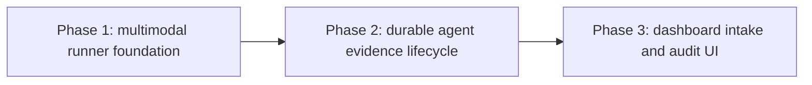

# Native image evidence for workflow reviewers: phased implementation

Status: Approved and scheduled after publication

Source plan: [`plan.md`](plan.md)

## Approved product decisions

- The first complete feature includes both dashboard image upload and session-attributed agent registration.
- V1 accepts PNG, JPEG, GIF, and WebP only.
- Images are immutable submission evidence, retained and pruned with raw workflow evidence.
- Each image targets one issued repository slot or all repositories in the same multi-repository submission.
- Every scheduled implementation task uses Codex with `gpt-5.6-sol` and `xhigh` reasoning.

## Repository findings applied to the split

The source plan's central diagnosis matches the current checkout: transcript text is captured with a 3,000-byte per-turn limit, while `WorkflowContextSnapshot.evidence`, submit and resubmit schemas, and `LlmRunOptions` have no image channel.

Investigation changed several proposed details:

- The Claude print one-shot implementation is in `src/server/llm/claude.ts`; there is no `src/server/llm/claude-cli.ts`. Phase 1 follows the implementation that exists.
- `POST /api/uploads` currently returns an absolute daemon path because chat attachments paste it into an agent prompt. Workflow evidence cannot trust that browser-visible path. Phase 2 adds an opaque server-issued evidence locator without breaking the existing attachment response.
- `src/server/mission-mcp.ts` owns launch registration, required-tool checks, and preapproval. The actual `submit_workflow_evidence` client tool belongs in `src/mcp/server.ts`, with its authenticated route in `src/server/routes.ts` and its workflow-owned behavior behind `WorkflowManager`.
- Workflow submission capture is the durable activation boundary. Images must be copied, hashed, persisted, and readable before `WorkflowEngine.activateSubmission` can run a Persona.
- Existing raw-evidence pruning is database-transactional, but image deletion also crosses the filesystem. Phase 2 must use explicit retained/pruned state plus recoverable cleanup so database claims and disk contents cannot silently diverge.
- The dashboard has several distinct capture entry points. `WorkflowBindingDialog`, run actions in `WorkflowRuns`, built-in Ship it actions, and ladder controls all converge on submit or resubmit routes, so the browser phase owns a shared evidence draft rather than independent attachment implementations.

## Size and phase-count rationale

Estimated production change: 1,700 to 2,500 non-test lines.

Assumptions behind the range:

- 250 to 450 lines for provider-neutral runner input, Claude and Codex transport encoding, validation, and accounting hooks.
- 900 to 1,300 lines for evidence contracts, SQLite migration and strict row access, secure intake, immutable copies, capture and fingerprint integration, retention, authenticated retrieval, and the MCP surface.
- 550 to 750 lines for shared browser evidence state, caption and repository-scope controls, run-history rendering, and fake-provider plumbing.

Three phases are justified. Combining the runner work with durable storage would put provider protocol risk, filesystem containment, migration compatibility, and workflow state transitions in one pull request. Combining the dashboard with the backend would add every human entry point and browser verification before the server contract is independently proven. The phases remain vertical where it matters: Phase 2 delivers end-to-end agent-supplied image evidence to Personas and history, while Phase 3 adds the second approved intake surface against that working contract.

## Phase graph

| Phase | Outcome | Direct prerequisite | Merge boundary |
|---|---|---|---|
| 1 | Headless Claude and Codex runners can receive bounded immutable images without changing text-only callers | Planning session | Optional runner input is independently contract-tested and unused by workflows until Phase 2 |
| 2 | An agent can stage contained screenshots and every Persona can inspect and cite the immutable submission images; retention and history APIs are complete | Phase 1 | The agent path forms a complete backend vertical slice and proves storage, recovery, and provider delivery |
| 3 | Humans can attach, caption, scope, inspect, and deliberately reattach evidence across all dashboard submission paths | Phase 2 | Browser behavior consumes the stable backend contract and adds required Playwright coverage |

All phases are serial. There is no safe concurrency group because Phase 2 consumes Phase 1's runner descriptor, and Phase 3 consumes Phase 2's schemas, routes, and run-detail payload.

## Cross-phase contracts

### Phase 1 to Phase 2

- `LlmRunOptions` gains one optional provider-neutral image list. Omitting it preserves existing argv, SDK input, timeout, structured-output, tool grant, and accounting behavior byte for byte.
- Each descriptor names a daemon-owned absolute path plus sniffed MIME type, byte count, digest, and stable evidence id. Providers receive images in list order.
- Runners reject unreadable, changed, unsupported, or mismatched files before starting a provider process. An image-bearing request never degrades to text-only.
- The compatibility probe performed in Phase 1 records the conservative image count, per-item bytes, aggregate bytes, and any provider-specific format constraints that Phase 2 centralizes as shared workflow limits.

### Phase 2 to Phase 3

- Submit and resubmit accept bounded evidence locators with item id, caption, and repository scope. Browser locators are opaque upload ids; agent locators are checkout-relative paths resolved from the attributed live session.
- The daemon owns staging, idempotency, reservation, immutable copying, hashing, and final submission association. UI code never sends or receives a Mission Control state path.
- Run detail exposes metadata and an authenticated id-based body route. Export includes metadata and digests only.
- A normal repair captures newly staged images and does not silently reuse an old set. An unchanged resubmission reuses the already captured set. Explicit historical reattachment creates a new staged locator.
- A changed digest or caption is fresh evidence for automatic resumption even when Git evidence is unchanged.

### Contracts no phase may weaken

- Persona attempts remain tool-less. Images are native model inputs, not file access grants.
- No browser or MCP argument can choose evidence storage or escape an issued repository root.
- Proof-of-work images remain uncommitted local evidence.
- Persona review remains before the authored pull-request session action.
- Multi-repository attribution is derived from durable binding and task records.

## Merge order

1. Merge Phase 1 and verify both provider transports plus every text-only regression.
2. Merge Phase 2 and verify an agent-staged image crosses capture, storage, Persona execution, citations, export, retention, restart, and deletion.
3. Merge Phase 3 and verify every human submission entry point plus run-history display in the built dashboard.

## Final verification strategy

Each phase runs focused Node tests with the repository preload. Phase 1 runs typecheck, lint, build, and smoke because bundled provider adapters change. Phase 2 additionally runs workflow database, capture, recovery, retention, security, MCP, export, and provider integration suites. Phase 3 runs the full UI contract checks and a Playwright spec against the built daemon and fake providers, followed by the full required gates in `AGENTS.md`.

The final browser evidence must prove pixels, not just metadata, reached both fake provider boundaries. Evidence screenshots produced by the spec stay under `e2e/.artifacts/workflow-image-evidence/` and remain uncommitted.

## Cross-phase audit

- 2026-08-15: Incorporated the submitted dashboard-and-agent intake decision and the `gpt-5.6-sol` / `xhigh` scheduling constraint.
- 2026-08-15: Reconciled the source plan against current provider, upload, Mission MCP, workflow capture, retention, and dashboard ownership paths.
- 2026-08-15: Assigned every source-plan requirement to exactly one phase. The only deliberate staged delivery is that Phase 2 completes the agent intake path before Phase 3 adds dashboard intake.
