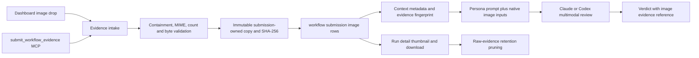

# Native image evidence for workflow reviewers

Status: Approved for implementation

## Objective

Let every workflow Persona inspect and cite screenshots that belong to the exact submission it is reviewing. Preserve the existing ordering of No-Mistakes Review: Personas review first, the authored pull-request action runs later, and evidence artifacts remain outside Git.

Success means a Test Evidence Auditor can receive pixels, caption, provenance, and a stable image id in round 1 or a repair round, and a human can inspect the same retained image from run history.

## Scope correction

The transcript is already review evidence. `readWorkflowContextRaw` captures a bounded transcript window and clips each turn to 3,000 UTF-8 bytes while setting `transcriptTruncated`. Text results should continue to be reported as concise counts and verdicts.

The missing channel is binary image evidence:

- `WorkflowContextSnapshot.evidence` contains diff, status, transcript, and standards, but no image metadata.
- `SubmitWorkflowSchema` and `ResubmitWorkflowSchema` accept no evidence attachments.
- `LlmRunner.run` accepts one prompt string, and the workflow engine starts each Persona with no tools.
- A path written in the transcript therefore reaches the reviewer only as characters, not as pixels.

This plan fixes that channel. It does not move the pull-request stage, make PR comments a prerequisite for review, or bless `docs/images/` as a proof-of-work destination.

## Product decisions

### Intake surface

Decision: ship both explicit dashboard upload and session-attributed agent registration in the first complete feature.

- Dashboard users can drop images into an evidence composer when they start, resume, or repeat a workflow review.
- Agents can call a new `submit_workflow_evidence` Mission MCP tool with checkout-relative image paths, captions, and repository scope before an automatic completion claim.
- Both paths create the same server-owned evidence locator. Neither path lets the caller choose a destination or submit an arbitrary absolute path.

### Supported artifact type

V1 accepts raster images already supported by the upload sniffer: PNG, JPEG, GIF, and WebP. PDFs, video, arbitrary binary attachments, OCR, and image generation are out of scope.

### Lifetime

Image bytes follow raw workflow evidence retention. Metadata, digest, caption, image id, verdict citations, counts, and pruning time remain after the bytes are pruned. Full run-family deletion removes the remaining rows and files.

### Repository scope

Every evidence item targets one issued repository slot or explicitly targets all repositories in a multi-repository submission. Dashboard submission from a binding defaults to that binding's repository. The daemon resolves scope from its own binding and task records.

### Implementation scheduling

Any implementation tasks created from this plan use `gpt-5.6-sol` with `xhigh` reasoning, per the operator's instruction.

## Proposed flow

The image copy is complete before any Persona attempt can be claimed. Reviewers never read a mutable checkout path and receive no filesystem tool grant.

## Contract and limit changes

### Shared workflow evidence

Add a browser-safe `WorkflowEvidenceImage` metadata record in `src/shared/workflow.ts`:

- stable image id and ordinal;
- sanitized display name;
- required caption describing what the image demonstrates;
- repository scope;
- sniffed MIME type, byte count, and SHA-256;
- availability state for retained versus pruned bytes.

Add `images` to `WorkflowContextSnapshot.evidence` and to its schema in `src/shared/protocol.ts`. Default missing `images` to an empty list so older stored snapshots remain readable. Extend the pruned retention record with image count and bytes.

Append `image` to `EVIDENCE_REF_KINDS`. Update the model-facing and strict verdict schemas together. For an image reference, `path` carries the stable image id and `quote` states the visual observation, not a fabricated text quotation.

### Intake schemas

Define one bounded locator shape shared by dashboard submission and the daemon:

- uploaded-image reference or checkout-relative path;
- caption;
- repository scope;
- client-generated item id for idempotent retries.

Mirror the agent tool schema in `src/mcp/server.ts`, as required for Mission MCP tools. Register the append-only tool name in `MISSION_MCP_TOOLS` and add a launch requirement only where the workflow completion contract will instruct an agent to call it. Do not make every unrelated ship task fail launch because an optional tool is unavailable.

Centralize limits. Start no looser than the existing 10 MB per-image upload limit, then set a conservative image-count and aggregate-byte ceiling from a live compatibility check against both installed providers. Captions, names, and locator arrays receive character and JSON byte bounds.

### Provider-neutral runner input

Extend `LlmRunOptions` with optional immutable local image descriptors. Leave every existing text-only caller byte-for-byte unchanged.

- Codex headless calls add one repeatable `codex exec --image` argument per retained file while keeping shell tools and approvals disabled.
- Claude SDK one-shot calls send one user message containing base64 image blocks followed by the existing text prompt.
- Claude print one-shots use a single `--input-format stream-json` user message with the same blocks while keeping a fresh process, no resume id, no tools, and the current structured-output contract.
- A runner must reject an unreadable image before provider invocation. It must not silently downgrade an image-bearing review to text-only.

Record prompt bytes plus attached image bytes in workflow LLM-call input accounting. Provider-reported token and cost accounting remains authoritative where available.

## Durable intake and capture

### Dashboard uploads

Reuse `POST /api/uploads`, `useImageDrop`, and `AttachmentStrip` for browser transfer, but add an evidence-specific caption and scope editor. The workflow submit and resubmit bodies carry opaque upload references, not trusted absolute paths. The daemon accepts only files it issued under the uploads root, re-sniffs them, and copies them into submission-owned storage before the seven-day upload sweep can remove them.

### Agent registration

Add `submit_workflow_evidence` as a session-attributed Mission MCP tool. The bridge sends its existing terminal environment, agent session id, and cwd. The daemon resolves the live session and its issued repository slots, then accepts only relative regular files inside those roots. Reject absolute paths, traversal, control characters, symlinked components, unsupported types, and files that exceed limits. Gitignored screenshots are valid because evidence artifacts are expected to be uncommitted.

Registration stages evidence for the next eligible submission on that conversation and repository. A duplicate call with the same item id is idempotent. Run detail and the bound-session surface show staged items and let a human remove an accidental one before capture.

### Submission ownership

Add a `workflow_submission_images` table beside `workflow_submissions` with submission id, image id, ordinal, caption, repository scope, MIME type, bytes, SHA-256, storage-relative path, state, and timestamps. Add the fresh schema, additive migration, indexes, strict row decoder, and old-database upgrade test together.

When a durable submission is created, reserve the matching staged items in the same transaction. Inside the existing per-conversation capture lock:

1. Resolve and open sources without following symlinks.
2. Read each source once, sniff and bound it, hash it, and atomically write a submission-owned copy under Mission Control state.
3. Persist image rows and bounded context metadata before compaction.
4. Include ordered image id, digest, caption, and scope in `workflowContextFingerprint`.
5. Activate the graph only after the final context and every retained image are durable.

Capture failure blocks the run with a typed image-evidence phase before any Persona token is spent. Retry reuses the same reserved locators. Startup recovery removes abandoned temporary copies but never a file referenced by a retained row.

### Fresh-evidence semantics

A changed image digest or caption is fresh evidence. Extend the cheap evidence probe with the staged-image generation or digest so Foreman auto-resumption can open a new round for a new screenshot even when repository bytes are unchanged. Transcript growth alone remains insufficient.

An unchanged resubmission reuses the captured image set exactly. A normal repair round consumes newly staged items and does not silently carry an old screenshot forward. The operator can deliberately reattach a prior image through the run UI if it still proves the repaired state.

## Persona execution and citations

`buildPersonaPrompt` adds an untrusted image manifest after workflow metadata. Each entry names its stable id, caption, display name, repository scope, MIME type, bytes, and digest. The corresponding runner image list uses the same ordinal order.

Update the immutable review contract and required JSON text so Personas may cite `kind: "image"`. The Test Evidence Auditor can pass only when its claimed visual behavior is supported by an attached image or by another adequate evidence source. An unavailable or unreadable image is infrastructure failure, not a fail verdict against the work.

Each Persona receives the same immutable image set. Context compaction remains text-only because it compacts intent, not evidence.

## Dashboard and audit history

Add the evidence composer to every human path that captures a new snapshot:

- Bind and submit or Preview;
- Ship it / start built-in review;
- Resume review / Preview fresh evidence;
- Run this review again.

Block the action while an upload is in flight or a caption is missing. Confirmations state the number and aggregate size of images that will be frozen.

Run detail shows an Evidence images section per submission with thumbnail, caption, scope, digest prefix, size, and retained/pruned state. Fetch image bodies through an authenticated, id-based route that opens the verified retained file with `O_NOFOLLOW`; the browser renders a blob object URL. Do not expose Mission Control state paths to the browser.

Run JSON export includes metadata and digests, not base64 bodies. Document that it remains an audit record rather than a full binary backup.

## Retention, reset, and deletion

Extend the existing raw-evidence compaction transaction to mark image bodies pruned and account for image count and bytes. Perform filesystem deletion through a retryable cleanup queue or an atomic trash rename so a database/file failure cannot leave a row claiming bytes that vanished.

Session reset and full run-family deletion remove image rows and retained files through the existing owners. Startup reconciliation repairs interrupted trash cleanup and reports orphan counts in workflow retention diagnostics. Active, blocked, failed, and delivery-uncertain runs keep their image bytes under the same eligibility rules as current raw evidence.

## Security and privacy invariants

- No arbitrary absolute path from a browser or MCP argument is read.
- Checkout-relative evidence cannot escape through `..`, a symlinked directory, or a swapped leaf.
- Upload MIME is decided by bytes, not extension or browser headers.
- Reviewers remain tool-less; images are explicit model inputs only.
- Image bytes never enter the prompt string, transcript, SSE snapshot, event payload, or context JSON.
- Logs and failures name stable ids and bounded diagnostics, not image bytes, base64, or sensitive absolute paths.
- Every collection and byte surface has a centralized bound.
- Proof-of-work images remain local evidence and are never committed automatically.

## Implementation map

| Area | Planned change |
|---|---|
| `src/shared/workflow.ts`, `src/shared/protocol.ts` | Image metadata, locators, limits, context schema, retention counts, `image` evidence references |
| `src/shared/llm.ts` | Optional provider-neutral image inputs on one-shot runs |
| `src/server/db.ts`, `src/server/workflows/store.ts` | Submission image rows, migration, strict reads, reservation, pruning, deletion |
| `src/server/workflows/context.ts`, new focused image module | Secure source resolution, immutable copy, metadata, fingerprint and probe integration |
| `src/server/workflows/manager.ts`, `engine.ts`, `prompt.ts`, `verdict.ts` | Capture orchestration, typed blocks, multimodal execution, citations and byte accounting |
| `src/server/llm/codex.ts`, `claude.ts`, `claude-sdk.ts` | Native image transport for both configured providers and Claude transports; the print path is owned by `claude.ts` |
| `src/server/mission-mcp.ts`, `src/mcp/server.ts`, `src/server/routes.ts` | Agent registration tool, mirrored validation, attribution and authenticated image body route |
| `src/web/components/ImageDrop.tsx`, workflow run/binding surfaces | Evidence composer, staged evidence, captions, scopes, thumbnails and pruning state |
| `docs/workflows.md`, `docs/sessions.md`, `e2e/README.md` | Submission behavior, MCP use, limits, retention, and evidence regeneration instructions |

## Tests and acceptance evidence

### Focused tests

- Snapshot schemas read old evidence with `images: []`; new metadata survives capture, export, and retention.
- The database upgrade path opens a pre-feature database and creates all image storage/index structures after their columns exist.
- Intake rejects traversal, absolute paths, symlink escapes, non-regular files, spoofed MIME, missing files, duplicate ids, oversized items, too many images, and aggregate overflow.
- Dashboard uploads and agent-relative files converge on byte-identical retained metadata.
- A digest or caption change moves the workflow evidence fingerprint; transcript-only growth still does not move the automatic repair probe.
- Initial, repair, continuation, unchanged, external, multi-repository, reset, cancellation, restart, prune, and full-delete paths leave no misattributed or orphaned image.
- Codex receives repeatable image arguments. Claude SDK and print transports receive image blocks. Text-only runner calls keep their existing argv and input shape.
- Persona prompts align image manifest order with runner image order and accept durable `image` citations.

### Browser end-to-end coverage

Add a Playwright spec that uses the real built dashboard and daemon with fake providers:

1. Drop a real PNG into a review evidence composer, caption it, submit, and prove the fake reviewer received both metadata and native image input before returning pass.
2. Open run detail and prove the retained thumbnail and caption are reachable by role and label.
3. Drive a failed round, stage a replacement screenshot without changing repository bytes, resume, and prove the new digest opens a fresh round.
4. Capture reviewer-visible screenshots into `e2e/.artifacts/workflow-image-evidence/`; never commit them.

Update the fake Claude and Codex executables so the spec fails when only image metadata arrives. This is the regression at stake: a green test must prove pixels crossed the provider boundary.

### Validation gates

- Focused `node --test --import ./test/setup-state.mjs --import tsx ...` files for every changed subsystem.
- `npm run typecheck`
- `npm run lint`
- `npm test`
- `npm run build`
- `npm run smoke`
- Focused Playwright spec, then `npm run test:e2e`

## Documentation and memory follow-up

Update workflow documentation in the same change. Correct the repository memory whose headline says review rounds cannot see replies: transcript text is visible but per-turn bounded, while images require native evidence transport. Keep the separate private-PR attachment memory because it remains true for the later PR-publishing stage.

## Definition of done

- A dashboard user and an automated session can explicitly submit a screenshot without committing it or opening a PR.
- The screenshot is copied, hashed, stored, fingerprinted, and delivered to every Persona on that submission before review begins.
- Claude and Codex reviewers see actual image content with tools disabled and can emit traceable image citations.
- A new screenshot can advance an otherwise code-unchanged repair round; incidental transcript growth cannot.
- Run detail renders retained evidence and clearly reports pruning.
- Security, migration, recovery, retention, unit, build, smoke, and browser gates pass.
- Product docs and repository memory state the corrected evidence model.
