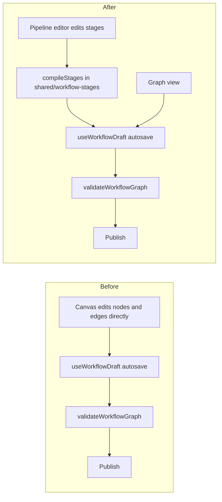

# Workflow pipeline UI

Migrate the Workflows page's two working surfaces - the builder and the runs monitor - to the
stage-based pipeline design (review mockups B and C, 2026-07-25). The freeform React Flow canvas
stops being the primary authoring surface; authoring becomes "stages of reviewers", and a run is
watched on the same pipeline shape its author drew. The graph model, storage, publish flow, engine,
bindings and deliveries do not change shape; the one semantic change is lifting the
one-submitted-route restriction so a first stage can hold parallel reviewers.

Source review: this plan implements the recommendations of the 2026-07-25 workflow feature review
(fan-out refusal reproduced live; UUID vocabulary; 8 edges for a 2-reviewer workflow; unthemed
canvas chrome; jargon empty states).

## Why

- The validator (`src/shared/workflow-graph.ts:170`) requires exactly one `submitted` edge, so the
  all-pass Join's headline case - N reviewers in parallel on the submission, all must pass - cannot
  be authored at all. The engine already fans out (one durable receipt per outgoing edge), so the
  cap is validator-only.
- Every legal workflow today is "Session, then waves of reviewers, then End, with every fail
  returning to Session". The canvas makes the operator hand-draw that grammar (8 precision edge
  drags for 2 reviewers, paired pass+fail edges into each Join) and then scolds them with codes
  (`join_missing_outcome`, `session_submitted_route`) when they miss. A stage editor makes the
  grammar unrepresentable instead of policed.
- The runs monitor is a wall of stacked sections naming nodes by UUID. Operators think in the
  pipeline they authored; the run should be displayed on it.

## Goals

1. Parallel first-wave review works: N reviewers in stage 1.
2. Authoring is stages: add/remove/reorder reviewers and stages; joins, fail routes, return edges
   and reachability are generated, never hand-drawn.
3. The runs monitor replays a run on the pipeline: per-reviewer live status, verdict cards, round
   scrubber, timeline - all data the current Runs tab shows, none of the UUIDs.
4. Human vocabulary everywhere: persona names, stage names, sentences. Machine codes demoted to
   detail affordances.
5. No storage migration. Graphs remain the only persisted truth; published versions stay immutable
   and readable; existing drafts keep working.

## Non-goals

- Mockup A's full canvas restyle. The Graph view survives as a co-equal fallback editor but only
  inherits what falls out of shared vocabulary work; re-theming React Flow chrome is not in scope.
- Engine, delivery, binding, Inspector-gate or persona-editor changes beyond the validator rule.
- New run capabilities. The monitor re-presents existing detail data.

## Design

### Stages are a projection, not a second model

The persisted model stays `WorkflowDraftGraph` / published graphs, untouched. A new browser-safe
module `src/shared/workflow-stages.ts` owns two pure functions and one predicate:

- `projectStages(graph)` returns the stage pipeline a graph expresses, or `null` when the graph is
  not stage-expressible.
- `compileStages(pipeline, previousGraph)` emits a `WorkflowDraftGraph`. It reuses node and edge
  ids from `previousGraph` wherever the same stage member survives, so autosave diffs, undo/redo
  history and version comparisons stay stable; only genuinely new members mint ids. Positions are
  generated deterministically (the pipeline has no free-form layout).
- `stageExpressible(graph)` is `projectStages(graph) !== null`.

**Stage-expressible** means exactly: one Session; a linear chain of 1..k stages; a stage is either
one Persona (pass to the next stage or End, fail to Session) or N Personas plus one `all_pass` Join
(every member's pass and fail into the Join, Join pass onward, Join fail to Session); one End
reached by the final stage; nothing else. Round-trip invariants are pinned by tests:
`projectStages(compileStages(p, g))` equals `p`, and compiling a projection of a stage-expressible
graph is semantically identical to that graph.

The editor never mutates edges directly. Every pipeline edit runs `compileStages` and hands the
result to the existing `useWorkflowDraft.update({ draft })` - CAS autosave, conflict handling,
undo/redo, publish and versions all behave exactly as today because they see an ordinary graph
edit.

### The validator change

`session_submitted_route` relaxes from exactly-one to at-least-one (`=== 0` still errors). The
engine needs no change - `advanceStructure` already writes one idempotent receipt per outgoing
edge - but gains a test proving N submitted edges activate N personas in parallel. The spec
sentence in `docs/plans/workflow-builder/phase-2-builder-publishing.md` (fan-out rules) is updated
in the same change, and `test/workflow-graph.test.ts` re-pins the new rule. Compatibility note: a
graph with two submitted edges published by this build would fail re-validation on an older build,
but published versions are immutable and the engine on older builds executes fan-out correctly, so
only cross-build re-publishing is affected.

### Pipeline editor (mockup B)

`src/web/workflows/PipelineEditor.tsx`, rendered by `WorkflowLibrary` when the draft is
stage-expressible; a Pipeline | Graph toggle in the toolbar switches surfaces (default: Pipeline
when expressible, Graph otherwise, with a banner naming why). Contents:

- Session and End as fixed termini in the fleet card grammar; stages between them; seams carry the
  "all pass" gate mark and an insert-stage affordance.
- A stage lists its reviewers (persona name, `runner · model` meta), an Add reviewer affordance
  (persona picker inline, replacing the sidebar palette's select-then-click), remove per reviewer,
  and drag or keyboard reordering of reviewers and stages.
- Destructive removals confirm through an overlay-hosted modal (the `KillModal` pattern), not
  `window.confirm`.
- The right rail keeps workflow settings (trigger, delivery, repair rounds, final gate - stale
  "(Phase 4/5)" labels removed), validation (in pipeline mode effectively "Ready to publish" or
  persona-level problems such as archived personas, phrased as sentences), version history, and a
  "Bind to a session..." call to action opening the existing `WorkflowBindingDialog`.
- Stage names are derived: single-reviewer stages take the persona name; multi-reviewer stages
  read "Stage N" with a member-count subtitle. No persisted stage label; the model is unchanged.
- Accessibility parity: roving focus across stages and reviewers, live-region announcements in
  persona names, every action keyboard-reachable. New keys register in `ACTIONS`
  (`lib/keybindings.ts`) and the README keyboard table.

The Graph view remains `WorkflowCanvas` as it is today - a co-equal fallback editor - and the
keyboard Connect dialog survives only there, with its option labels switched to `nodeLabel()`
names.

### Shared vocabulary

`nodeLabel(graph, node, personas)` in `src/shared/workflow-stages.ts` (persona name, "Session", stage or
join label, End outcome) is adopted by: the pipeline editor, the runs monitor, the Graph view's
connections list, edge and node aria labels, live announcements, and diagnostics rendering
(message first, code as a hover/detail affordance). No surface prints a node or edge UUID.

### Runs monitor (mockup C)

`WorkflowRuns.tsx` is rebuilt around the pipeline strip; the run list rail and every existing
action and recovery affordance carry over:

- Rail: runs with tone chips (running / waiting / passed / failed), filter chips (All, Running,
  Needs you, Done) mapping the existing status filter, session branch and relative time.
- Header: workflow name + version chip, status chip, link to the bound session, and the contextual
  actions exactly as today (Export, Cancel, Resubmit, Retry provider call, Prepare PR, Recheck
  Inspector, Restart all Personas).
- Round scrubber: rounds come from `detail.submissions`; selecting a round scopes the strip,
  verdicts and timeline to that submission (latest selected by default).
- Pipeline strip: `projectStages(version.graph)` plus the existing `workflowNodeStatuses(detail)`
  map drives per-reviewer status chips (queued / reviewing / pass / fail / cancelled) on the
  authored shape. A run of a non-stage-expressible version falls back to today's read-only
  `WorkflowCanvas` with node statuses - no capability is lost.
- Verdict cards in the fleet card grammar: verdict chip, persona name, summary, evidence
  references, runner/model/duration/cost meta. Inspector gate, Foreman completion claims,
  deliveries and their recovery controls render as sections in the same grammar, keeping the
  existing state machinery (uncertain deliveries, retry, resolve).
- Timeline: the existing run events, phrased with `nodeLabel` names, grouped by round.
- Empty state: "No workflow runs yet" plus a working "Bind to a session..." button (the dialog
  already supports a target-less open), replacing the jargon sentence.

New CSS lands in the existing workflows section of `styles.css` under `wf-`-prefixed classes; the
new surfaces stop reusing `persona-error` and friends outside the Persona library.

### Copy pass riding along

Where the new surfaces replace old strings: internal plan-phase labels disappear from dropdowns,
the palette design-note footnote goes, empty states name their next action, timestamps render
relative. The Personas tab is untouched.

## Phases

1. **Model groundwork.** Validator relaxation + engine fan-out test + `workflow-stages.ts`
   (projection, compiler, expressibility, `nodeLabel`) with round-trip, id-stability and taxonomy
   tests over the existing graph fixtures. No UI change; ships green on its own.
2. **Pipeline editor.** `PipelineEditor.tsx`, the Pipeline | Graph toggle in `WorkflowLibrary`,
   overlay confirm modal, right-rail updates, vocabulary adoption in the Graph view's panels,
   keyboard registry + README. The canvas remains the fallback editor.
3. **Runs monitor.** The `WorkflowRuns` rebuild: rail, header actions, round scrubber, pipeline
   strip with statuses, verdict/gate/delivery cards, timeline, bind CTA. Canvas fallback for
   non-stage-expressible versions.
4. **Cleanup and settings placement.** Remove strings and affordances the new surfaces obsoleted;
   move the Workflow settings drawer into a Settings page category (registered in
   `SETTINGS_CATEGORIES`, discoverable by settings search) with the Workflows page linking to it.

Each phase updates the README in the same change and lands its tests (`node:test`,
`renderToStaticMarkup` for markup questions, route tests via `buildApp`). Existing suites expected
to change: `workflow-graph.test.ts` (relaxed rule), `workflow-builder-*` (a11y/render equivalents
for the pipeline), `workflow-canvas.test.ts` (unchanged), plus new `workflow-stages.test.ts` and
`workflow-runs-render.test.ts`.

## Risks

- **Projection round-trip subtleties.** Id stability across edits is the hard invariant; getting it
  wrong breaks undo or manufactures CAS churn. Mitigated by property-style tests before any UI.
- **Graphs in the wild that are almost expressible** (for example a fail routed to the Join but not
  to Session) open in Graph view instead of Pipeline; the banner must say precisely what blocks
  projection, or operators will read it as a bug.
- **Runs parity.** The current reader exposes many recovery affordances; the rebuild must inventory
  them first (they are enumerated in `WorkflowRunView`) so none are dropped silently.
- **Cross-build re-publish** of fan-out graphs fails validation on older builds (noted above);
  acceptable for a single-operator tool, called out in the README changelog line.

## Adopted decisions (submitted 2026-07-25)

1. **Session fan-out rule**: relax `session_submitted_route` to at-least-one. The engine is ready
   and stage 1 parallelism depends on it.
2. **Graph view's role**: co-equal fallback editor. Pipeline is the default for stage-expressible
   graphs; the canvas still edits anything, so no migration pressure on existing drafts.
3. **Stage naming**: derived names only. No model change.
4. **Workflow settings placement**: migrate the drawer into a Settings page category in phase 4,
   restoring the registry convention and settings-search coverage.
5. **Follow-up**: create the phased implementation plan (phase documents beside this plan plus
   dependency-linked Mission Control tasks).
