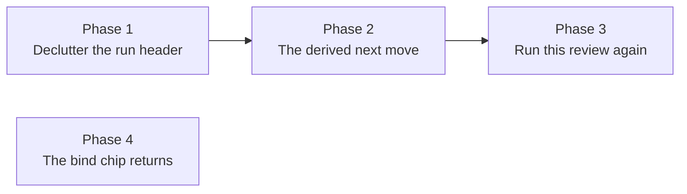

# Workflow run controls redesign - phased implementation

## Source

- Approved plan: [`plan.md`](plan.md), rendered at [`plan.html`](plan.html).
- Reviewed mockups: [`mockups.html`](mockups.html) - Mockup A and Mockup B across five run states,
  built from the real token and class values in `src/web/styles.css`.
- Investigated against the tree at `18528997` (`origin/main`).

## Incorporated human decisions

Submitted through the plan review and treated here as requirements, not open questions.

| Decision | Adopted | Owning phase |
| --- | --- | --- |
| Approach | **Mockup A - zones in the header.** One derived primary in the action row; a sentence in the identity block when there is no move. Mockup B's state card is **not** implemented. | Phase 2 |
| Run id and both JSON downloads | A collapsed "Audit and bug reports" `<details>` at the page bottom beside the Timeline. | Phase 1 |
| Terminal runs | Offer **Run this review again** through the existing binding submit route. No new endpoint. | Phase 3 |
| Copy feedback | Stays in the header, zone 2. | Phase 2 |
| Bug: `Copy run id` silent clipboard failure | Fixed via `copyText()`. | Phase 1 |
| Bug: `＋ workflow` chip vanishing forever | Gate reads openness through `workflowRunIsOpen`. | Phase 4 |
| Bug: `Open PR` disabled on runs with no PR concept | Made conditional on the completion policy. | Phase 2 |

## Findings that changed the plan

Four repository facts moved work between phases or added scope the source plan did not have.

1. **`Open PR` cannot be made conditional on its own.** `WorkflowRuns.tsx:568` asserts the action is
   always present (`…find(…)!`) and dereferences it unconditionally at `713-727`. Adding the policy
   condition without repairing that call site throws a `TypeError` on every non-inspector run. The
   condition and the repair are therefore one atomic change, owned by Phase 2, which is why Phase 1
   deliberately leaves `Open PR` alone even though it is removing four neighbouring controls.

2. **The unchanged-evidence affordance is derivable from run detail, but the request id is not.** The
   manager persists the refusal as a run phase - `waiting_for_session`/`unchanged_evidence`, or
   `blocked`/`unchanged_evidence_exhausted` (`manager.ts:4420-4426`) - so `runNextMove` can decide
   *whether* to offer "Review this snapshot anyway" without client state. But replaying the original
   `requestId` revives the failed submission **in the same round**
   (`manager.ts:1153-1171`), while a fresh id takes the
   `createRepairSubmission({ round: latest.round + 1 })` path (`manager.ts:1227-1236`) and **burns a
   repair round**. So the existing `unchangedRequest` ref (`WorkflowRuns.tsx:1451`) must survive
   Phase 2's refactor untouched. Recorded as an explicit constraint rather than discovered mid-edit.

3. **The bind-chip fix must not touch `workflowRunBySession`.** Narrowing that map to open runs would
   delete the Approved/Failed chip (`session-bits.tsx:141-175`), the board tile's ladder
   (`SessionTile.tsx:215-224`) and the console Workflows tab body (`ConsoleDetail.tsx:460-465`), all of
   which deliberately read terminal runs. Every consumer that needs openness already re-narrows with
   `workflowRunIsOpen` (`held.ts:22-31`, `held.ts:47-51`, `BacklogColumn.tsx:405`). The two bind-chip
   gates are the only misreaders, so Phase 4 is scoped to those two call sites and records the map
   change as a forbidden "simplification".

4. **Two copy gaps the source plan did not name.** `BLOCKED_PHASE_CLAUSES` (`run-model.ts:660-684`) has
   no entry for either unchanged-evidence phase, so today they render the raw
   `phase.replaceAll("_", " ")` fallback ("unchanged evidence exhausted"). And `.wf-run-version`
   (`styles.css:435-441`) sets no `background`, so promoting the badge to a `<button>` renders a filled
   pill - found by rendering the mockup, not by reading the CSS. Assigned to Phases 2 and 1
   respectively.

## Phases

| # | Phase | File | Depends on | Delivers |
| --- | --- | --- | --- | --- |
| 1 | Declutter the run header | [`phase-1-declutter-run-header.md`](phase-1-declutter-run-header.md) | - | Audit disclosure; version badge absorbs `Open version`; four controls leave the header; clipboard bug fixed |
| 2 | The derived next move | [`phase-2-derived-next-move.md`](phase-2-derived-next-move.md) | 1 | `runNextMove`; one primary; the why-sentence; `Open PR` conditional; unchanged-evidence prose |
| 3 | Run this review again | [`phase-3-run-review-again.md`](phase-3-run-review-again.md) | 2 | Terminal runs offer a fresh run through the existing binding submit route |
| 4 | The bind chip returns | [`phase-4-bind-chip-returns.md`](phase-4-bind-chip-returns.md) | - | `＋ workflow` reappears once a run is terminal |

## Dependency graph



Phase 4 has no edges: it shares no file with any other phase.

## Concurrency groups

| Group | Phases | Why they may run together |
| --- | --- | --- |
| A | **1** and **4** | Disjoint file sets. Phase 1 edits `WorkflowRuns.tsx` and `styles.css`; Phase 4 edits `SessionCard.tsx`, `ConsoleDetail.tsx` and possibly `held.ts`. |
| B | **2** (after 1) and **4** | Same reasoning. Phase 4 may still be open when Phase 2 starts. |
| C | **3** (after 2) and **4** | Same reasoning. |

Phases 1 → 2 → 3 are strictly sequential: all three restructure the same JSX region
(`.wf-run-actions`, `WorkflowRuns.tsx:629`) and the same derivation module (`run-actions.ts`).
Splitting them concurrently would conflict on nearly every changed line.

Merge order: `1`, then `2`, then `3`. Phase `4` merges at any point, before or after any of them.

## Cross-phase contracts

Established by an earlier phase, relied on by a later one, and not to be changed without editing the
owning phase's file.

| Contract | Owner | Consumers |
| --- | --- | --- |
| `.wf-run-actions` contains only run-affecting controls; the audit trio lives in `.wf-run-audit` | 1 | 2, 3 |
| The version badge owns composer navigation; no `Open version` button returns | 1 | 2, 3 |
| `copyText()` is the only clipboard path in `WorkflowRuns.tsx` | 1 | 2, 3 |
| `download` filenames stay `workflow-run-<id>.json` and `workflow-version-<n>.json`, matching the server's `Content-Disposition` pinned by `test/workflows-http.test.ts:261-307` | 1 | - |
| `runNextMove(detail)` is the only place a primary move is decided, returning at most one descriptor | 2 | 3 |
| `RunNextMove.path` is a full path string and `confirm` is part of the interface from the start | 2 | 3 (its arm is binding-keyed and confirmed) |
| `runNoMoveReason(detail)` owns the why-sentence | 2 | 3 |
| One `RunActionId` per intent, dispatched through the shared `run-action-store` | 2 | 3 |
| `unchangedRequest`'s request-id retention is preserved, so an unchanged resubmit does not burn a repair round | 2 | 3 |
| `runRemedy` in `run-model.ts` is unchanged; it serves a summary-only surface under a stricter contract | 2 | 3 |
| `.wf-run-actions-danger` is untouched: `Restart full workflow` and `Cancel run` keep placement, tone and phrase confirmation | 1, 2 | 3 |
| `workflowRunBySession` retains terminal runs; openness is read per call site via `workflowRunIsOpen` | 4 | - |

## Requirement ownership

Every source-plan requirement and submitted selection, mapped to exactly one phase.

| Requirement | Phase |
| --- | --- |
| Remove `Copy run id`, `Export run`, `Export version`, `Open version` from the header | 1 |
| Audit disclosure beside the Timeline | 1 |
| Version badge becomes the composer link | 1 |
| Clipboard bug (`copyText()`) | 1 |
| `runNextMove` and the next-move table | 2 |
| One primary control, never two | 2 |
| The why-sentence replacing disabled stand-ins | 2 |
| `Open PR` absent rather than disabled, plus the `!` repair | 2 |
| Unchanged-evidence prose in `BLOCKED_PHASE_CLAUSES` | 2 |
| `Copy feedback` stays in the header | 2 (retained, not moved) |
| `Run this review again` on terminal runs | 3 |
| Bind chip returns after a terminal run | 4 |
| Mockup B's state card | none - explicitly rejected |
| A new import endpoint, a run-id filter, an overflow kebab menu | none - explicitly out of scope |

## Final verification strategy

Every phase runs the same five commands, and each ships its own Playwright spec because the repository
requires one for every UI change with no exemptions:

```sh
npm run typecheck
npm run lint
npm test
npm run build      # required before e2e: the suite drives dist/, not src/
npm run test:e2e   # needs `npx playwright install chromium` once per machine
```

New specs, one per phase:

| Phase | Spec | Seeds from |
| --- | --- | --- |
| 1 | `e2e/specs/workflow-run-audit.spec.ts` | `workflow-skipped-status.spec.ts:44-95` (simplest completed run) |
| 2 | `e2e/specs/workflow-next-move.spec.ts` | `workflow-blocked-resubmit.spec.ts:45-103` (`E2E_FAIL_VERDICT`) |
| 3 | `e2e/specs/workflow-run-again.spec.ts` | `workflow-skipped-status.spec.ts:44-95` |
| 4 | `e2e/specs/workflow-bind-chip-returns.spec.ts` | `workflow-ladder-members.spec.ts:73-133` (`seedApprovedRun`, returns sessionId) |

Existing specs and tests each phase must update, so no phase discovers them late:

| Phase | Must update |
| --- | --- |
| 1 | `test/workflow-runs-render.test.ts:503-517`, `:1039`, `:1081`; `test/workflow-builder-render.test.ts:331` |
| 2 | `test/workflow-runs-render.test.ts` (header assertions → `runNextMove` unit table); `test/workflow-ladder-actions.test.ts`; `e2e/specs/workflow-blocked-resubmit.spec.ts:116-156` |
| 3 | `test/workflow-runs-render.test.ts` (terminal rows) |
| 4 | the `renderToStaticMarkup` tests covering `SessionCard` / `ConsoleDetail` headers |

Not to be touched, despite matching on the string `Cancel run`:
`e2e/specs/line-drawers.spec.ts:617,630,810` click the **confirm modal's** button raised by the review
drawer's Dismiss remedy (`run-model.ts:1585`), not the run header's.

There is no shared e2e seeding helper. Each of the twelve existing workflow specs carries its own
`api` + `dispatch` + `seed*Run` copies; that is the established pattern, not an oversight to route
around. Every agent binary is redirected at a fake by `e2e/fixtures/fake-agents.ts`, so no spec spends
model tokens - a dispatch launches the CLI through both the one-shot `claude -p` runner and the Agent
SDK session, and both stay faked.

After all four phases merge, the run header offers at most six controls (one primary, up to three
context, two destructive), a stopped run explains itself in prose, a finished run can be run again from
either the run page or the session surfaces, and the run id and both JSON exports are one disclosure
away rather than competing with `Cancel run`.
