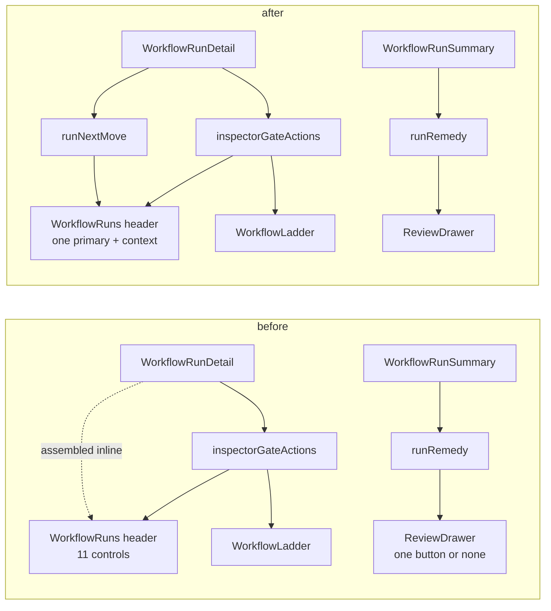
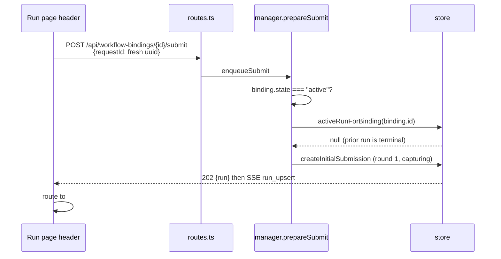
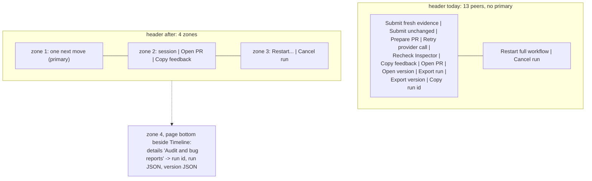

# Workflow run controls redesign

## Decisions taken

Reviewed against two rendered mockups in [mockups.html](mockups.html), which show both candidates
across five run states using the real token and class values from `src/web/styles.css`.

| Decision | Adopted | Rejected alternative |
| --- | --- | --- |
| Where the reason and the move live | **A - zones in the header.** One derived primary in the action row; a sentence in the identity block when there is no move. | **B - a tone-tinted state card** beneath the header pairing reason with move. Reads better on a stopped run and has room for the round budget, but spends a card row on every healthy run and risks stacking with the two `role="status"` banners this page already renders. |
| Run id and the two JSON downloads | Bottom disclosure, "Audit and bug reports", beside the Timeline. | Removing them outright; keeping them in the header. |
| Terminal runs | Offer **Run this review again**, through the existing binding submit route. | Leaving terminal runs read-only. |
| Copy feedback | Stays in the header, zone 2. | Moving it onto the failing stage rung as `WorkflowLadder` does. |
| Related bugs | **All three ship with this change** (see Related bugs found). | Deferring the bind-chip fix to keep the diff on one page. |

## The evidence

The screenshot that prompted this plan is a run in the `session_disappeared` state: status
`Blocked`, round 1 of 6, and the bound session name struck through. That strikethrough is
`.wf-run-session:disabled` (`src/web/styles.css:515-519`), which fires on
`!sessionBound`, meaning `detail.binding.sessionId === null` - the conversation this run was
reviewing is gone.

The header offers nine controls in that state:

| Control | Enabled? | Does it help? |
| --- | --- | --- |
| Submit fresh evidence | disabled | no - refused, "The bound session is gone" |
| Submit unchanged | disabled | no - same refusal |
| Copy feedback | enabled | yes |
| Open PR | disabled | no - run has no adopted PR |
| Open version | enabled | no - navigates to the composer |
| Export run | enabled | no - downloads JSON nothing can read back |
| Export version | enabled | no - downloads JSON nothing can read back |
| Copy run id | enabled | no |
| Cancel run | enabled | yes - and it is the only honest move left |

Nine controls, two of which do anything for the person reading the page, and the one that
resolves the run sits last and furthest right.

Meanwhile the fleet triage drawer, looking at the same run through a strictly *smaller* data
set, renders exactly one button: **Dismiss**. `runRemedy` in
`src/web/workflows/run-model.ts:1575-1591` maps `session_disappeared` to a single cancel with
a confirmation, because that is the only thing that needs nothing but a run id and the only
thing the daemon will accept.

The drawer already got this right. The run page has more information and gives less guidance.

## Who this page is for

The consuming user. Somebody whose agent is being reviewed by a workflow they did not author.
They care about four questions, in this order:

1. **Is it moving?** Status, round N of M, which stage.
2. **If it stopped, why?** In a sentence, not a phase enum.
3. **What is the one thing I do about it?** Resume, retry, restart, cancel, run it again.
4. **Where is the work?** Jump to the session, open the PR, get the feedback out.

Nothing in that list is served by a run id, a run JSON, or a version JSON.

## The three questions, answered

### Why would I copy the run id?

For almost nothing. The run id is a durable internal identifier. The page's own filter rail
(`src/web/workflows/WorkflowRuns.tsx:1695-1754`) filters by **State**, **Workflow id** and
**Session** - there is no run-id filter to paste it into. The route is already
`#/runs/{runId}`, so on the web build the id is in the address bar, and on the Electron build
there is no address bar to need it for. Its real consumers are `curl` against the loopback API
and a bug report to whoever wrote the workflow. Both are developer acts.

It is also the only clipboard control on the page that bypasses the shared helper:

```ts
// WorkflowRuns.tsx:775
onClick={() => void navigator.clipboard.writeText(detail.run.id)}
```

`src/web/lib/clipboard.ts:9` exists precisely because "the async Clipboard API can be absent
or permission-blocked even after a direct click", and it falls back to a synthetic selection.
`Copy feedback` uses it. `Copy run id` does not, so in the Electron renderer it can fail
silently - the rejected promise is swallowed by `void`. So the least useful control on the
page is also the only broken one.

### Why would I export the run?

There is nothing to export it *to*. There is no import endpoint anywhere in the codebase, and
that is deliberate and test-enforced:

```ts
// test/workflow-security.test.ts:38
assert.doesNotMatch(routes, /app\.(?:post|put|patch|delete)\([^)]*\/export/);
```

```
docs/plans/workflow-builder/phase-6-hardening-polish.md:189
Import remains out of scope to avoid inventing conflict and trust rules at the end of the project.
```

So an exported run is a file that no surface in this product consumes. Everything in it is
already rendered on the page below the header - the timeline, reviewer verdicts, the Inspector
gate, deliveries, evidence snapshots and the workflow-owned model calls. Export is a bug-report
attachment. That is a real use, and it is not a header use.

### Why would I export the version, when versions live in the composer?

You would not. That reading is correct. The version is immutable and owned by the Library and
the composer, and `Open version` already navigates there
(`requestWorkflowVersionOpen` + hash route, `WorkflowRuns.tsx:735-743`). `Export version`
downloads the definition of the workflow, which says nothing about whether *this run* is
healthy. It is library surface leaking into a run-monitoring page.

## The doctrine is already written down

Two places in this codebase state the rule the run header breaks.

`src/web/styles.css:17152-17155`, on the console footer's action pills:

> Coloured by consequence, at rest rather than on hover - four identical grey pills make you
> read the labels to find the one you want, and the destructive one sits inches from the
> harmless one.

`src/web/workflows/run-model.ts:1472-1482`, on what a triage row may offer:

> 1. **The route must need nothing but a run id.** [...] A triage row has no room for a form,
>    and a control that opens one is the run page wearing a disguise.
> 2. **The SUMMARY must prove the daemon will accept it.** A button that always answers 409 is
>    worse than no button.

The run header is eleven identical grey pills (`btn` and `btn-ghost`, no primary anywhere) with
the destructive ones one row down. And it violates rule 2 in the other direction: it renders
`Open PR` disabled on every run with no PR to open, and both submissions disabled
whenever the binding is not active.

The redesign is not a new idea. It is applying the drawer's doctrine to the page the drawer
defers to.

## The redesign: one next move, then the rest

Four zones replace one flat row.

### Zone 1 - the next move (exactly one, `.btn-primary`)

A new `runNextMove(detail)` in `src/web/workflows/run-actions.ts` returns at most one action.
It is the detail-level sibling of `runRemedy`, and because it reads `WorkflowRunDetail` instead
of `WorkflowRunSummary` it can resolve a move in the states `runRemedy` explicitly punts to the
run page - the gate actions, the targeted retry, the unchanged-evidence recovery.

The label is an imperative in the user's language, not the route's:

| Run state | Next move | Label | Route |
| --- | --- | --- | --- |
| `capturing`, `running` | none | - | live progress speaks |
| `waiting_for_session` | resubmit | Resume review | `resubmit` |
| `waiting_for_session` after a `workflow_unchanged_evidence` refusal | resubmit unchanged | Review this snapshot anyway | `resubmit` + `resubmitUnchanged` |
| `waiting_for_pr`, gate offers the handoff | prepare-pr | Ask the session to open a PR | `prepare-pr` |
| `waiting_for_pr`, no handoff arm | recheck | Check again | `recheck-inspector` |
| `waiting_for_inspector` | recheck | Check again | `recheck-inspector` |
| `waiting_for_new_head` | recheck | Check again | `recheck-inspector` |
| `blocked` / `infrastructure_error` | retry | Retry the failed call | `retry` |
| `blocked` / `check_cleanup_unresolved`, `capture_*` | resubmit | Resume review | `resubmit` |
| `blocked` / `unchanged_evidence_exhausted` | resubmit unchanged | Review this snapshot anyway | `resubmit` + `resubmitUnchanged` |
| `blocked` / `inspector_disabled` | none | - | the Inspector gate section already offers Open Inspector settings |
| `blocked` / `round_limit`, `session_disappeared` | none | - | Cancel is the honest move |
| `blocked` / delivery phases | none | - | the deliveries section owns the choice |
| `blocked` / `inspector_findings`, `inspector_pr_closed` | none | - | the findings list owns the choice |
| `completed`, `cancelled`, `failed` | run again | Run this review again | `workflow-bindings/{id}/submit` |

`runNextMove` is deliberately **POST-only**: every move it returns is a mutation dispatched through
the shared action store. Navigation is not modelled here. That is why `inspector_disabled` resolves
to no move rather than to a "Turn Inspector on" button - `onOpenInspectorSettings` is a callback prop
(`WorkflowRuns.tsx:449`), and an `Open Inspector settings` button already exists at
`WorkflowRuns.tsx:1069` inside the Inspector final gate section, which is the section that owns it.

Where the answer is **none**, the header says so in one sentence and names where the decision
lives, which is the same closing move `runRemedy` makes:

> Everything else - Inspector findings, a closed pull request, an unresolved delivery - is
> blocked on a DECISION, and the material for that decision is the run page's. The row still
> says why; it just does not pretend one button settles it.
> (`run-model.ts:1593-1596`)

So: "This run is waiting on a delivery decision below." Never a disabled button standing in for
a sentence.

The refusal copy that `resubmitAvailability` already produces
(`run-actions.ts:191-199`) becomes that sentence rather than a tooltip on a dead control. In the
screenshot's state the header would read *"The session this run was reviewing is gone, so it
cannot take another round."* with Cancel run in the danger zone, and nothing else.

### Zone 2 - context links (ghost, at most three)

Get me to the work. These do not change the run.

- **The session name** - already a link in the identity block (`WorkflowRuns.tsx:612-623`). Stays.
- **Open PR** - only rendered when `gate.state.prUrl` exists. A disabled Open PR on a run with
  no PR to open is noise, and that includes an `inspector`-policy run still waiting for one; today it
  is pushed unconditionally (`run-actions.ts:94-103`).
- **Copy feedback** - stays, using `copyText()`. This is the one control here that a consuming
  user reaches for constantly: it is how the review's verdicts get into their agent.

### Zone 3 - destructive, kept apart (unchanged)

`.wf-run-actions-danger` already does the right thing and the code says why
(`WorkflowRuns.tsx:782-783`, `styles.css:528-529`): separated by a `border-left`, never filled
red, because these sit beside actions an operator clicks all day. **Restart full workflow** and
**Cancel run** stay exactly as they are, phrase confirmation included.

### Zone 4 - the audit disclosure, out of the header

`Copy run id`, `Export run` and `Export version` move to a `<details className="wf-run-audit">`
at the bottom of the page, beside the Timeline, where audit material already lives. The
precedent and its charter are `ScheduleDetail.tsx:186` / `styles.css:20505`:

> The exact stored configuration: an audit view, so it sits behind a disclosure.

Relabelled honestly, since nobody is "exporting" anything:

- Run id, with a copy affordance that uses `copyText()`
- Download run JSON
- Download workflow version JSON

Summary text: **"Audit and bug reports"**. That names who the contents are for, which is the
whole point of moving them.

### The version badge absorbs Open version

`Open version` becomes the `v8` badge itself (`.wf-run-version`, `WorkflowRuns.tsx:609`). The
badge already displays the version; making it the link kills a header button and puts the
affordance where the information is. Tooltip: "Open workflow version 8 in the composer."

### Count

| | Today | After |
| --- | --- | --- |
| Header controls, maximum | 11 + 2 danger = 13 | 1 primary + 3 context + 2 danger = 6 |
| Header controls, screenshot state | 9 | 1 (Cancel run) + a sentence |
| Controls that change the run, screenshot state | 1 of 9 | 1 of 1 |

## New capability: Run this review again

This is the gap behind "reschedule it fresh", and today the page has no answer. On a terminal
run every control is inert: `resubmitAvailability` returns `null` for anything not
`waiting_for_session` or `blocked` (`run-actions.ts:188`), and Cancel run is not rendered at
all (`WorkflowRuns.tsx:804`). A completed or failed run offers Copy feedback, Open PR, Open
version, Export run, Export version and Copy run id - six controls, none of which run anything.

It needs **no new endpoint**. `POST /api/workflow-bindings/{bindingId}/submit` already does it:

- `activeRunForBinding` defines "open" by SQL exclusion of exactly the three terminal statuses
  (`src/server/workflows/store.ts:2468-2475`), so once a run is `completed`/`cancelled`/`failed`
  the `run_active` refusal (`manager.ts:1042-1045`) no longer fires.
- The binding stays `active` after its run finishes. Nothing in the completion path writes
  `workflow_bindings.state`; the only writers are orphan, pause and archive
  (`store.ts:5168`, `5201`, `5234`).
- There is no once-only guard. `test/workflow-bindings-http.test.ts:388-424` already pins submit
  → idempotent replay → completed with the binding untouched.
- Idempotency is by `requestId`, so a fresh `crypto.randomUUID()` starts a new run and a replay
  returns the old one.

Preconditions to mirror in the client, in the manager's own order: binding `state === "active"`,
no active run, and not externally sourced. Confirmation is warranted but not phrase-gated - it
spends model tokens and creates a new run, so the confirm body should say so.

`WorkflowBindingDialog.tsx:414-418` already ships this call under the label
**"Submit bound version"**, so the mechanism is proven in the UI. The label is the problem, not
the plumbing.

## Related bugs found

Three, all in scope for this change: they are the same surface, and two of them are what make the
run page's dead ends dead.

1. **`Copy run id` can fail silently in Electron.** `WorkflowRuns.tsx:775` bypasses
   `copyText()`. Fixed for free by rebuilding it inside the audit disclosure.

2. **The `＋ workflow` bind chip disappears forever once a session has ever had a run.**
   `SessionCard.tsx:271-283` and `ConsoleDetail.tsx:286-295` both gate on `!workflowRun`, and
   `workflowRunBySession` (`App.tsx:966-973`) keeps the newest run per session *including
   terminal ones* - nothing prunes completed runs from the SSE map. So after one review
   completes, the session surfaces offer no way to run a workflow on that session again, and
   neither does the run page. "Run this review again" closes the loop from the run page; the
   chip's own gate should become "no *open* run" rather than "no run ever".

3. **`Open PR` is rendered disabled whenever there is no PR to open.** `inspectorGateActions`
   pushes it unconditionally (`run-actions.ts:94-103`), so it appears greyed out both on runs with no
   pull-request concept at all and on `inspector`-policy runs still waiting for a PR - the latter being
   the common case, since such a run is parked precisely *because* no PR is adopted yet. The gate
   section below already says so and offers `Prepare PR in session`, so the header button repeats it.
   The condition is **a usable `gate.state.prUrl`**, not the completion policy; requiring the URL
   covers both cases at once. It should be absent, not disabled, which is rule 2 of the doctrine above.

## Files touched

| File | Change |
| --- | --- |
| `src/web/workflows/run-actions.ts` | add `runNextMove(detail)`; gate `open-pr` on a usable `gate.state.prUrl` |
| `src/web/workflows/WorkflowRuns.tsx` | rebuild `.wf-run-actions` as zones; add the audit `<details>`; link the version badge; add Run again |
| `src/web/styles.css` | `.wf-run-why`, `.wf-run-audit`; keep `.wf-run-actions-danger` |
| `src/web/components/SessionCard.tsx`, `layouts/ConsoleDetail.tsx` | bind chip gate: no *open* run, not no run ever |

`run-model.ts`'s `runRemedy` is left alone. It serves a summary-only surface under a stricter
contract, and collapsing the two would drag detail-only fields into the drawer. They stay
siblings that agree on vocabulary - one `RunActionId` per intent, never one per surface
(`run-model.ts:1485-1487`).

## Testing

- **`e2e/` spec, required.** `e2e/specs/workflow-run-controls.spec.ts`: a blocked run with a
  gone session shows one sentence and Cancel run and *not* the submissions; a terminal run
  offers Run this review again and starting it produces a new run id; the audit disclosure is
  collapsed until opened. No `data-testid`; select by role and accessible name.
- **`e2e/specs/workflow-blocked-resubmit.spec.ts:116-156`** asserts the current
  `Preview fresh evidence` / `Preview unchanged` / `Cancel run` header. Update to the new labels.
- **`test/workflow-runs-render.test.ts:503-517`** asserts all six of Copy feedback, Copy run id,
  Export run, Export version, Open version, Cancel run in the header. Rewrite as the zone
  assertions, plus a `runNextMove` unit table covering every row of the table above.
- **`test/workflow-builder-render.test.ts:331`** covers the Runs-to-composer version handoff;
  retarget from the button to the badge.
- **Unaffected, despite the string match:** `e2e/specs/line-drawers.spec.ts:617,630,810` click
  `Cancel run` on the *confirm modal* raised by the drawer's Dismiss remedy
  (`run-model.ts:1585`), not the run header.
- `styles.css:1050-1075` needs no entry - the audit disclosure is in the document flow, not a
  popover, so the Electron drag-region list does not apply.

## Deliberately not doing

- **An overflow kebab menu.** There is no reusable menu primitive; `OpenInMenu.tsx` and
  `LaunchMenu.tsx` are ~90% duplicated hand-rolled popovers with capture-phase Escape handling
  and a drag-region registration requirement. Introducing a third to hide three controls
  nobody needs is more machinery than deleting the problem. A `<details>` has precedent and
  costs nothing.
- **Removing export entirely.** Bug reports are a real use. The disclosure keeps it reachable
  and stops it competing with Cancel run.
- **A run-id filter.** That would make Copy run id useful, which is solving the wrong problem.

## Flow changes

### The decision layer

Today the run header hand-assembles its own controls inline, bypassing the shared module, while
`runRemedy` - the one function that actually decides *the* move - is reachable only from the drawer.
After this change the header's controls come from `runNextMove` instead of being assembled in place.

`runNextMove` is the **header's** derivation only. `WorkflowLadder` keeps reading
`inspectorGateActions`, which already serves both surfaces today and continues to; this plan only
tightens its policy filter. Migrating the ladder onto `runNextMove` is deliberately not proposed -
the ladder offers no submissions at all today (`WorkflowLadderProps` takes no resubmit callback), so
giving it a primary move would be a change to what the session pane does, which is not what this plan
is for.



### Run this review again

The new action is the only one on the page keyed by binding rather than run, and the only one
that creates a run instead of advancing one. It reuses the existing binding submit path.



### Control surface, before and after

The header goes from one flat wrapping row of up to thirteen peers to four zones with one
primary, and the audit trio leaves the header for a disclosure beside the Timeline.


