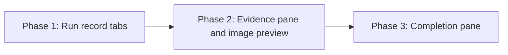

# Workflow run detail consolidation: phased implementation

Source plan: [`plan.md`](plan.md) (rendered: [`plan.html`](plan.html))
Mockups: [`mockups.html`](mockups.html)

## Incorporated human decisions

These were submitted against the source plan and are requirements here, not open questions.

| Decision | Chosen | Owned by |
| --- | --- | --- |
| Approach | Tabs under Review worklist, with counts and an amber badge on every tab label, and the ledger treatment of Deliveries and Evidence | Phase 1 (shell, Deliveries), Phase 2 (Evidence) |
| Human decision bodies | One summary row each, expanding on click | Phase 1 |
| Image thumbnails | A strip above the claims, plus a small copy on each citing claim row | Phase 2 |
| Scope | The three screenshot sections plus the GitHub Inspector final gate and the Foreman completion claim; model calls and Timeline unchanged | Phase 1 and 2 (three sections), Phase 3 (gate and claims) |

## What the repository says

Investigated before drawing the boundaries. Where the source plan and the code disagree, the code wins and the difference is recorded here.

- **One file owns almost all of it.** `src/web/workflows/WorkflowRuns.tsx` is 3,927 lines and contains every section in scope: `SubmissionImageEvidence` (lines 218-317), `SubmissionEvidenceReadiness` (318-509), the Review worklist section (2465-2514), the Inspector gate (2516-2632), the Foreman completion claim (2634-2650), the deliveries (2652-2741) and the captured context (2742-2866). Roughly 640 existing lines are restructured. Line numbers throughout these documents are as of this branch's merge base and are locators, not identities: find the symbol or the heading, and treat a drifted number as drift rather than as a missing target. This is the dominant fact for phase boundaries: phases cannot be made concurrent by topic because they share one file.
- **The tab component exists.** `.workflow-tabs` is already styled (`src/web/styles.css`, `.workflow-tabs`) and used by `src/web/pipelines/RunsKindTabs.tsx` with a real `role="tablist"`. It takes a badge (`.workflow-tab-badge`). No new component family is needed, only a container.
- **The route has no pane field.** `src/web/workflows/useWorkflowRoute.ts` parses `#/runs/:runId` with exactly three query parameters (`status`, `workflowId`, `session`), and `missionRouteHash` serialises a `MissionRoute` back out of its own typed fields. A parameter with no field cannot survive the round trip, so "the selected pane lives in the route" means adding a field, a parse arm and a serialise arm, not passing a query through.
- **The worklist carries a tour target.** `useTourTargetRef<HTMLElement>("library:run-worklist")` is attached to the Review worklist section and `src/web/tour/tours/library.ts` steps onto it. The worklist must stay the default pane and keep that ref on a node that is in the DOM when the tour runs.
- **The worklist is already bounded and is not in scope.** `.wf-run-worklist` is a 300px rail plus detail, both capped at `min(52vh, 480px)`. It measured 220px. It moves into a tab pane and is otherwise untouched.
- **Payload `<pre>`s are already capped.** `.wf-run-card pre`, `.wf-run-context pre` and `.wf-run-packet pre` cap at 340px with `overflow: auto`. The measured cost of Repair delivery is four cards of exactly 560px, so the win comes from replacing card chrome with rows, not from truncating payloads.
- **Human decisions are the uncapped block.** They render as `<ul class="wf-run-decisions"><li>
` with no cap, measured at 2,996px for nine entries. This is the only place the plan's decision changes reading behaviour rather than layout.
- **Inspector findings are not in the worklist.** `runChangeWorklist` in `src/web/workflows/run-model.ts` is built only from Persona attempt verdicts (`if (!attempt.persona) continue`). A finding has never appeared there, so the Completion pane is the only surface that shows them and folding them into the worklist would change what that list means.
- **A cross-reference will go stale.** `src/web/workflows/run-actions.ts` (`consequence` on the disabled-Inspector action) reads "Turn it back on from Open GitHub Inspector settings, in GitHub Inspector final gate below." Once the gate is a tab that sentence is wrong. `test/workflow-runs-render.test.ts` asserts that exact sentence.
- **The preview has a model to copy.** `AttachmentStrip` and `AttachmentPreview` in `src/web/components/ImageDrop.tsx` own the dispatch modal's image preview: `Overlay` with `OVERLAY_IDS.attachmentPreview`, `.modal attach-preview`, `.modal-head`, `.modal-body attach-preview-body`, `.attach-preview-image` capped at `min(70vh, 720px)`, plus `captureFocusBookmark`/`restoreFocusBookmark`. Two differences are forced by the data and are not choices: a frozen image is fetched from `/api/workflow-runs/:runId/images/:imageId` rather than painted from a local blob, and it has metadata and a re-stage action that the dispatch case does not.
- **Existing coverage that must move with the sections.** `test/workflow-runs-render.test.ts` (2,865 lines) asserts the gate heading, the context headings and the disabled-Inspector sentence. Four e2e specs assert the affected surfaces: `workflow-session-action-run.spec.ts` on the "Deliveries to the session" heading, `workflow-round-limit-grant.spec.ts` on the "Last workflow observation" and "Current Inspector" regions, plus `workflow-image-evidence.spec.ts` and `workflow-evidence-readiness.spec.ts`.

## Sizing

**Estimate: 1,100 to 1,500 non-test implementation lines**, gross added or materially changed, excluding tests.

Assumptions behind the range: roughly 620 existing lines in `WorkflowRuns.tsx` are restructured rather than deleted, so most of that count reappears as pane components; about 250 lines of new CSS across the tab panes, the ledger tables, the image strip and the preview footer; about 150 lines of new selectors in `run-model.ts` for the counts and summary sentences the tab labels and closed rows need; about 100 lines for the preview overlay component; about 40 lines of route work. Test lines are excluded but are not small: four existing e2e specs need updating and three new ones are required.

**Three phases.** The 200-line one-shot threshold is exceeded by roughly seven times, so the question is only where to cut. Each phase below is a vertical slice that ships working behaviour and leaves the page operable.

Why not fewer:

- **Phase 1 and 2 combined** would be about 1,000 lines in one pull request against a 3,915-line file, and would mix the mechanical work (a tab shell, two sections becoming ledgers) with the one genuinely new surface (an image strip and a modal that does not exist yet). The image work has its own accessibility, focus and lazy-load questions; burying it behind 600 lines of restructuring makes both halves harder to review.
- **Phase 2 and 3 combined** would be about 750 lines and would put two unrelated review conversations in one pull request: whether an image preview handles focus correctly, and whether an Inspector gate still reports the same facts through a different shape.
- **Phase 1 alone as a one-shot for everything** is the same argument at full size.

Why not more: no phase here is split by application layer. Each carries its own schema-free selectors, its own markup, its own CSS and its own tests. There is no preparation phase, no test-only phase and no cleanup phase; the copy fix in `run-actions.ts` travels with the phase that makes it wrong.

## Phases

| Phase | Name | Delivers | Depends on |
| --- | --- | --- | --- |
| 1 | [Run record tabs: shell, Deliveries, Intent](phase-1-run-record-tabs.md) | The tab bar, the worklist as the default pane, Repair delivery as a ledger, Captured intent with collapsible decisions, and the pane in the route | none |
| 2 | [Evidence pane with image thumbnails and preview](phase-2-evidence-pane-and-image-preview.md) | Image evidence and Evidence readiness merged into one pane, a thumbnail strip, thumbnails on citing claim rows, and the preview modal | Phase 1 |
| 3 | [Completion pane](phase-3-completion-pane.md) | The GitHub Inspector final gate and the Foreman completion claim folded into a fifth tab | Phase 2 |

## Dependency graph

## Concurrency

**None. The three phases are strictly serial.**

This is a file-ownership constraint, not a logical one. Phases 2 and 3 are logically independent: the Evidence pane and the Completion pane share no data, no selector and no route field, and either could be built against Phase 1 alone. They are serialised because both make large edits to the same regions of `src/web/workflows/WorkflowRuns.tsx` and both add rules to `src/web/styles.css`, so running them concurrently would produce two branches whose merge is a manual reconstruction of one file. Phase 3 therefore takes Phase 2 as a direct prerequisite.

Merge order is 1, then 2, then 3.

## Cross-phase contracts

Phase 1 establishes these and later phases consume them without changing them:

- **`RunRecordTabs`**, the tab container in `WorkflowRuns.tsx`, owns the tab list, the selected pane, the counts and the amber badge. Phase 2 and Phase 3 add a pane to its registry; neither reimplements the bar.
- **The pane registry shape.** A pane is `{ id, label, count, blocking, render }`. `blocking` drives the amber badge. A pane whose `render` returns null is not offered as a tab, which is how Completion stays absent on a run with no gate and no claim.
- **The initial-selection order.** An explicit route pane wins **only when that pane is registered
  and renderable for this run**; a route naming an absent pane is ignored for selection. Otherwise
  the selection is the blocking worklist, else the first blocking pane in tab order, else the
  worklist. This is what makes the plan's "a blocking container opens itself" true for tabs, since
  the amber badge alone does not. It is an *initial* selection, computed once per run: a state that
  turns blocking while someone is reading raises the badge and does not move them. Later phases
  participate by setting `blocking` honestly rather than adding a rule.
- **The route field.** `MissionRoute` for `page: "runs"` gains an optional `pane` whose values are the pane ids. Phase 2 and Phase 3 add an id to that union and to nothing else.
- **`runRecordSummary`** in `run-model.ts` returns the per-pane counts and summary sentences. Phase 2 and Phase 3 extend it with their own fields rather than computing counts in the view.
- **Every action keeps its route.** Retry refused delivery, the uncertain-delivery resolutions, evidence readiness retry and override, re-stage, and the Inspector settings button all keep their existing handlers and confirm dialogs. No phase may drop one to simplify a pane.
- **No `data-testid`, ever.** Panes are reached by `role="tab"` and accessible name. The tab bar is a real `role="tablist"` with arrow-key movement, implemented once in Phase 1.

## Final verification

After Phase 3 merges, the run detail page below the round scrubber is: the round scrubber, the notice band, the session actions section, the `RunRecordTabs` container, the workflow-owned model calls section and the Timeline. The last two are deliberately unchanged.

Per phase: `npm run typecheck`, `npm run lint`, `npm test`, `npm run build`, `npm run smoke`, and `npm run test:e2e`. Every phase changes UI surfaces, so every phase ships a Playwright spec and updates the existing specs its change invalidates. `renderToStaticMarkup` cases pin the summary sentences and counts, which are the new failure mode this work introduces: a closed row that states a wrong number is worse than a long page.
